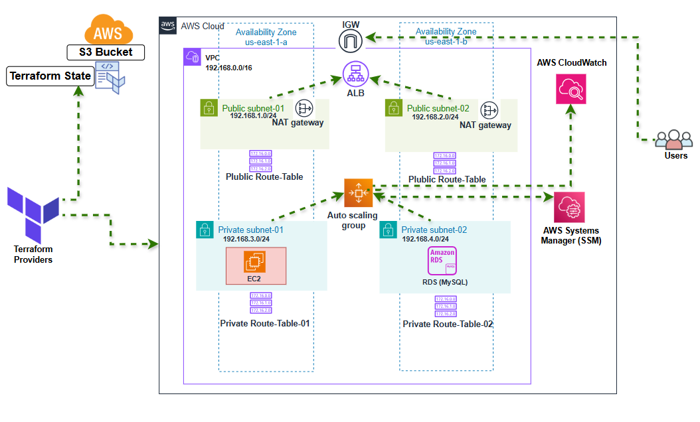

# Multi-Environment AWS Infrastructure with Terraform

# Overview

This project provisions a highly available, secure, and scalable AWS infrastructure using Terraform.
It is structured into reusable modules and supports multiple environments (dev and prod).

# Key features include:

1. Modular design for Networking, Compute, Database, and Monitoring

2. Auto Scaling with CPU-based policies

3. Secure VPC setup with public/private subnets and NAT Gateways

4. Application Load Balancer (ALB) distributing traffic across EC2 instances

5. RDS with automated backups and maintenance windows

6. Centralized monitoring with CloudWatch Alarms

7. Separate environments (dev, prod) managed independently

.
├── modules/
│   ├── networking/     # VPC, subnets, route tables, IGW, NAT, etc.
│   ├── compute/        # EC2, Auto Scaling Group, Launch Template, ALB and scaling policies
│   ├── database/       # RDS instance + automated backups, subnet group and parameter group
│   └── monitoring/     # CloudWatch alarms, sns
│
│
├── backend.tf         # Remote backend configuration
├── providers.tf       # AWS provider configuration
├── main.tf            # Root module to orchestrate sub-modules
├── variables.tf       # Global input variables
├── outputs.tf         # Global outputs
├── terraform.tfvars   # Default variable values
└── .gitignore

# Deployment

Navigate into the desired environment folder: cd development-env
Initialize Terraform: terraform init
Plan the deployment: terraform plan
Apply the configuration: terraform apply

# Features
- **Networking Module**: Sets up a VPC with public and private subnets across multiple availability zones, including NAT Gateways for secure outbound internet access from private subnets, Route tables for controlled routing

- **Compute Module**: Deploys an Application Load Balancer (ALB) to distribute traffic, an Auto Scaling Group (ASG) with a Launch Template for EC2 instances, and configures scaling policies based on CPU utilization, Session Manager for secure access (no direct SSH)

- **Database Module**: Provisions an RDS instance with automated backups, a subnet group for high availability, and a parameter group for custom configurations

- **Monitoring Module**: Sets up CloudWatch Alarms for CPU utilization thresholds and integrates with SNS for notifications

# Environment Structure
- Each environment (dev, prod) has its own folder with a main.tf file that calls the root module and overrides variables as needed
- This structure allows for isolated management and deployment of resources per environment

# Prerequisites
- Terraform installed (version 0.13+)
- AWS CLI configured with appropriate credentials
- IAM permissions to create and manage AWS resources
- SSH key pair for EC2 instance access (if needed)

# Architecture Diagram
